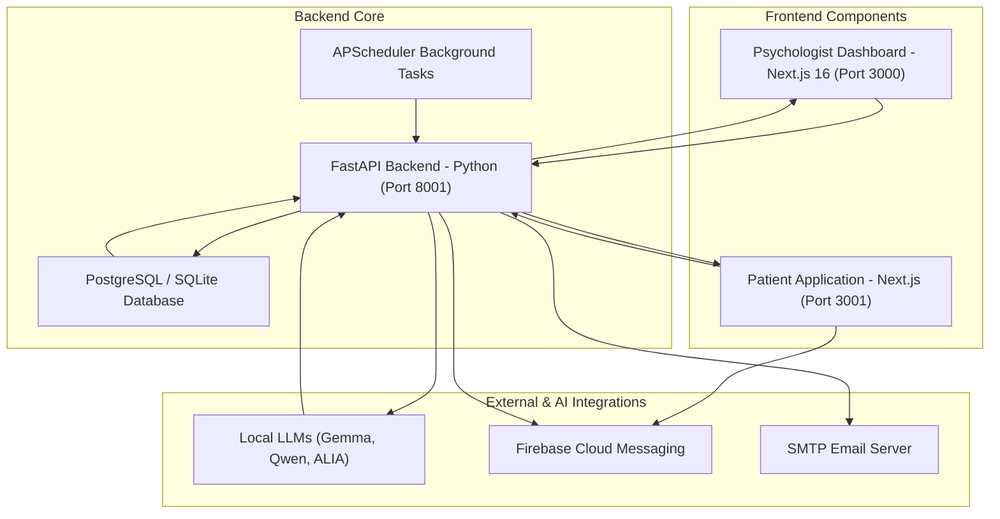
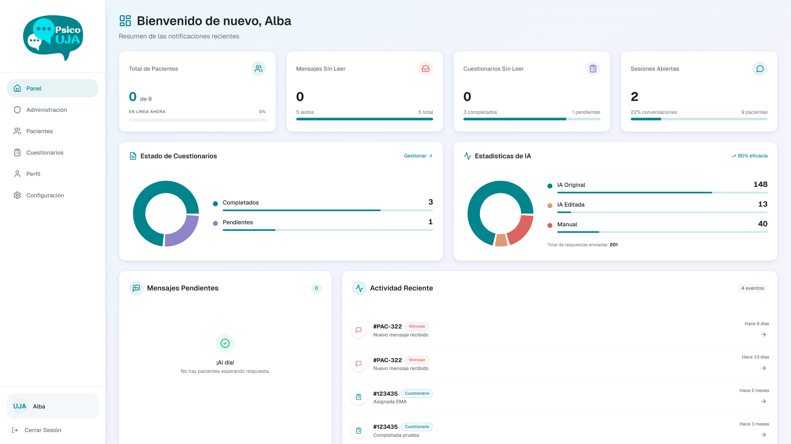
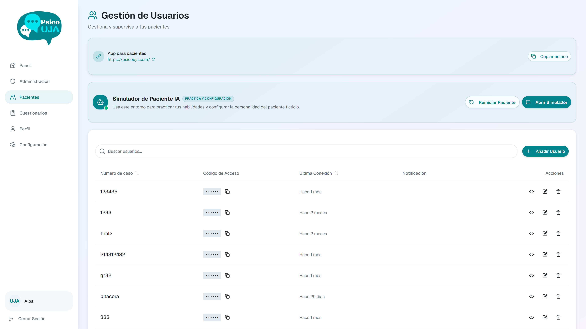
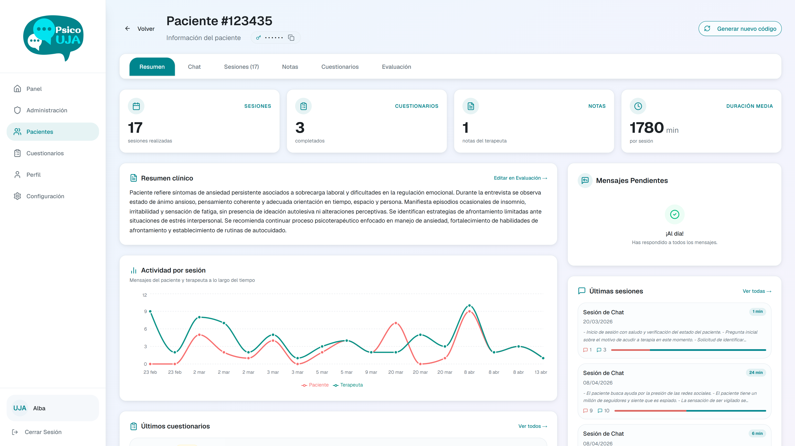
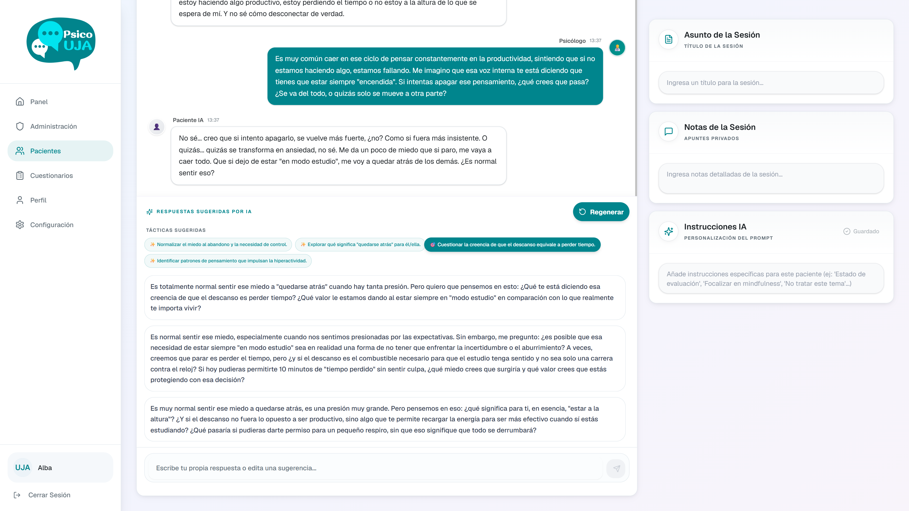
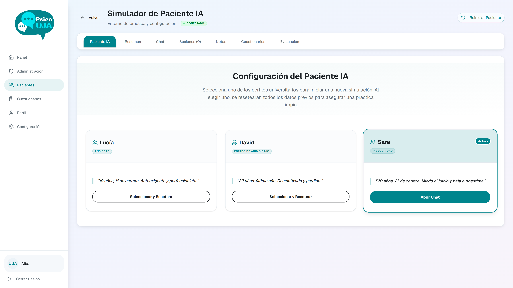

<p align="center">
  
</p>

<h1 align="center">🧠 PsicoUJA — Comprehensive Clinical Psychology Platform</h1>

<p align="center">
  <a href="https://fastapi.tiangolo.com/"></a>
  <a href="https://nextjs.org/"></a>
  <a href="https://www.typescriptlang.org/"></a>
  <a href="#"></a>
  <a href="https://tailwindcss.com/"></a>
  <a href="https://firebase.google.com/"></a>
</p>

Welcome to **PsicoUJA**, a state-of-the-art, end-to-end clinical psychology management, training, and tracking platform. Designed to bridge modern digital tools with clinical practices, PsicoUJA empowers psychologists with interactive dashboards and AI patient simulation modules, while providing patients with a seamless, mobile-friendly interface for therapy messaging and daily clinical tracking.

> [!WARNING]
> **Academic and Research Disclaimer**: This platform has been developed strictly for academic, research, and therapist-training simulation purposes. It is **NOT** ready, certified, or intended for real-world clinical use, medical diagnoses, or deployment in production environments with actual patients.

---

## 🗺️ System Architecture & Interaction Flow

PsicoUJA is comprised of three unified components designed to collaborate securely in real-time. Below is a high-level visual representation of how the Psychologist Dashboard, Patient App, and Backend API interact with external services:



---

## 📁 Repository Directory Structure

The repository is organized into three distinct sub-projects, each serving a core layer of the architecture:

```bash
Psicouja/
├── backend/            # Python FastAPI backend & database layer
│   ├── main.py         # Application entry point & FastAPI Lifespan (DB init)
│   ├── database.py     # Session pool configuration & connection drivers
│   ├── models.py       # SQLModel declarations & Pydantic validation schemas
│   ├── auth.py         # Cryptographic JWT helpers & Role-Based Access Control (RBAC)
│   ├── llm_service.py  # Asynchronous LLM client & Clinical therapy prompts
│   ├── routers/        # Endpoint controllers (auth, patients, chat, sessions, etc.)
│   └── services/       # Async background runners (Firebase SDK, APScheduler)
│
├── frontend/           # Next.js 16 Psychologist & Admin dashboard
│   ├── app/            # Next.js App Router (Pages, Patients, Simulator, Analytics)
│   ├── components/     # High-fidelity dashboard widgets & forms
│   ├── contexts/       # Bilingual localization and Authentication states
│   ├── proxy.ts        # Next.js 16 Proxy Convention for route & access logging
│   └── styles/         # Global styling and Tailwind CSS configs
│
└── user-app/           # Mobile-responsive Patient application
    ├── app/            # Next.js App Router (Assessments, Secure Chat, Progress)
    ├── lib/            # Firebase SDK setup and state handlers
    ├── components/     # Accessible mobile UI components
    └── styles/         # Responsive Tailwind styling configurations
```

### 📄 Sub-Project Documentation Links

For detailed technical specifications, internal structures, environment configurations, and setups specific to each component, refer to their dedicated documentation:
* **⚡ Backend Core**: See the [Backend README](./backend/README.md) & [Backend Installation Guide](./backend/INSTALL.md).
* **🩺 Psychologist Dashboard**: See the [Frontend README](./frontend/readme.md) & [Frontend Installation Guide](./frontend/INSTALL.md).
* **📱 Patient Application**: See the [Patient App README](./user-app/README.md) & [Patient App Installation Guide](./user-app/INSTALL.md).

---

## ⚡ Core Features

* **📋 Ecological Momentary Assessments (EMA)**: Automated daily scheduling of clinical tracking forms for patients, with real-time progress charts for therapists.
* **🤖 AI-Simulated Practice Client**: Practice sandbox for therapists to train in clinical frameworks (CBT/ACT) using AI-simulated patient profiles powered by local LLMs.
* **💬 Secure Chat & AI Supervision**: Real-time messaging between patients and therapists with dynamic strategy recommendations (validation, Socratic questioning, etc.) from an AI supervisor.
* **🛡️ RBAC & Audit Logging**: Cryptographically secure JWT tokens with specific roles (Patient, Psychologist, Superadmin) and automated logs for security-critical actions.

---

## 🖼️ Application Showcase

Explore the interactive interface of the PsicoUJA platform:

### 🩺 1. Psychologist Dashboard
An elegant and premium dark-themed interface built with Next.js 16 and Tailwind CSS 4, providing real-time clinical metrics, active session counts, and interactive tracking.



---

### 👥 2. Patient Management
A high-fidelity dashboard containing the complete listing of active patients, their assigned treatment protocols, risk levels, and direct action triggers.



---

### 📊 3. Clinical Patient Profile
Detailed telemetry tracking for each patient, displaying dynamic progression charts (EMA tracking), questionnaire logs, and historical session notes.



---

### 💬 4. Secure Chat & AI Supervisor
Real-time encrypted messaging channel between therapist and patient, featuring active side-by-side AI Supervision that recommends clinical interventions in real-time.



---

### 🤖 5. AI Patient Simulator Sandbox
A dedicated training module allowing psychologists in training to conduct simulated consultations with custom AI patient personas under different clinical models (CBT, ACT).



---

## 🚀 Unified Local Installation & Quick Start

To run the entire ecosystem locally on your machine, follow these instructions.

### 📋 Prerequisites
Ensure you have the following installed:
* **Node.js** (v18.x or higher)
* **Python** (v3.9 or higher)
* **npm** or **pnpm** package manager
* (Optional) **PostgreSQL** database (default fallback is local SQLite)

---

### ⚙️ Step 1: Spin Up the FastAPI Backend

1. Navigate to the backend directory:
   ```bash
   cd backend
   ```

2. Create and activate a Python virtual environment:
   ```bash
   # Windows
   python -m venv venv
   .\venv\Scripts\activate

   # macOS / Linux
   python3 -m venv venv
   source venv/bin/activate
   ```

3. Install required packages:
   ```bash
   pip install -r requirements.txt
   ```

4. Configure your environment:
   Copy `.env.example` to `.env` and adjust the variables (such as DB connections, mail credentials, and Firebase secret keys):
   ```bash
   cp .env.example .env
   ```

5. Launch the FastAPI server:
   ```bash
   python main.py
   ```
   * The backend will run on **`http://localhost:8001`**.
   * Interactive API documentation is available at [http://localhost:8001/docs](http://localhost:8001/docs).

---

### 🩺 Step 2: Launch the Psychologist Dashboard (Frontend)

1. Open a new terminal window and navigate to the frontend directory:
   ```bash
   cd frontend
   ```

2. Install Node dependencies:
   ```bash
   npm install
   ```

3. Setup environment variables:
   Copy `.env.example` to `.env.local` and define backend endpoints:
   ```bash
   cp .env.example .env.local
   ```
   Ensure `NEXT_PUBLIC_API_URL` is pointing to your active backend (e.g. `http://localhost:8001`).

4. Launch the dashboard dev server:
   ```bash
   npm run dev
   ```
   * The dashboard will be available at **`http://localhost:3000`**.

---

### 📱 Step 3: Run the Patient Application (User App)

1. Open a third terminal window and navigate to the user-app directory:
   ```bash
   cd user-app
   ```

2. Install Node dependencies:
   ```bash
   npm install
   ```

3. Setup environment variables:
   Copy `.env.example` to `.env.local` and configure your Firebase credentials and backend URLs:
   ```bash
   cp .env.example .env.local
   ```

4. Launch the patient app dev server (on a distinct port):
   ```bash
   # If running on npm, run dev
   npm run dev -- -p 3001
   ```
   * The patient mobile interface will be active at **`http://localhost:3001`**.

---

## 📊 Summary of Defaults

| Component | Technology | Default Port | Main Access Link | Documentation (README) |
| :--- | :--- | :--- | :--- | :--- |
| **Backend Core** | FastAPI + Python | `8001` | [http://localhost:8001/docs](http://localhost:8001/docs) | [📖 Backend README](./backend/README.md) |
| **Psychologist Dashboard** | Next.js 16 + Tailwind 4 | `3000` | [http://localhost:3000](http://localhost:3000) | [📖 Frontend README](./frontend/readme.md) |
| **Patient Application** | Next.js + Firebase | `3001` | [http://localhost:3001](http://localhost:3001) | [📖 Patient App README](./user-app/README.md) |

---

## 🛠️ Verification & Testing

* **Backend Sanity Check**: Run `python check_health.py` inside `/backend` to verify API and basic database connections.
* **Database Migrations**: Helper scripts like `migrate_to_postgres.py` are available inside the `/backend` folder to transition seamlessly from local SQLite development to production PostgreSQL databases.
* **Environment Validation**: Double-check that both frontend apps point to `http://localhost:8001` as their underlying API to sync auth sessions, charts, and secure chats correctly.

---

## 📄 License

This project is licensed under the Apache License 2.0. See the [LICENSE](./LICENSE) file for the full text.
